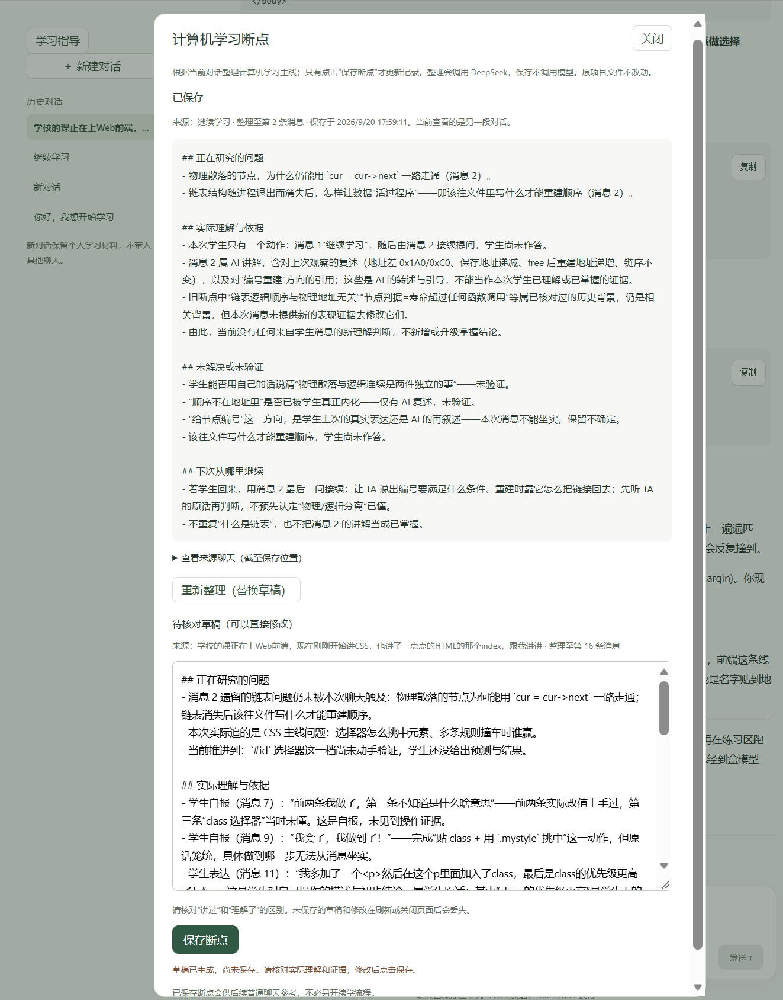
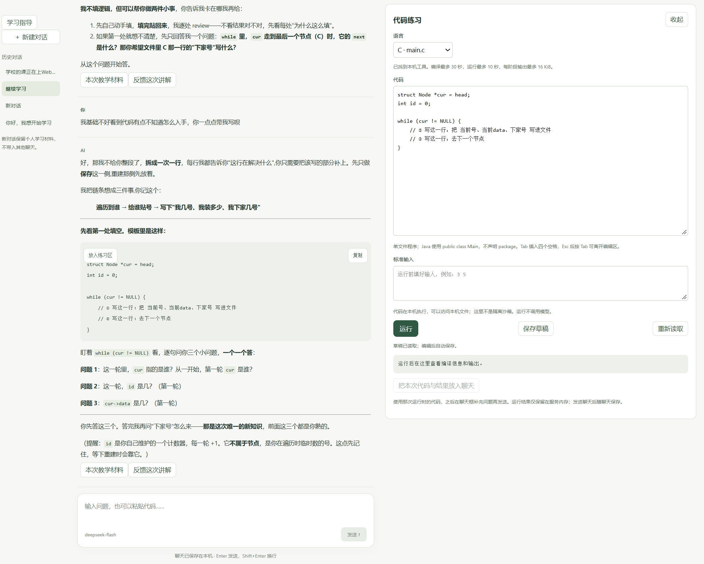

# Trae-Learning App

**面向长期编程学习的有状态 LLM 教学原型。** 从个人使用 AI 学编程的经历出发，把跨会话上下文、用户确认的学习状态更新和本地代码运行证据连接起来，让后续教学有可回看的依据。

当前已实现本地聊天、学习断点、教学材料维护和 C / Java 单文件练习。项目处于开发预览阶段，尚未完成最终整体验收，也未开展系统性的学习效果评估。开发过程中使用 AI 编程工具协作，重点探索教学流程与状态管理的设计和实现。

## 为什么做

长期使用普通 LLM 对话学习时，我遇到了三个相互关联的问题：

| 真实问题 | 本项目的处理方式 |
|---|---|
| 换一个会话后，难以保留上次卡住的问题和理解边界 | 将教学材料、会话记录与学习断点分别保存，新一轮请求读取已确认的上下文 |
| 模型可能把“讲过了”或“说懂了”误判为掌握，错误记录又影响后续教学 | AI 只提出草稿或修改建议，由用户核对、修正并确认后写入长期记录 |
| 只有聊天时，模型可能根据描述或猜测讨论程序行为 | 提供本地 C / Java 编译执行，用户主动把当次源代码、输入和实际输出带入聊天 |

这些机制旨在让学习过程能够延续，让模型判断可以纠正，让程序行为有实际结果可查；它们是否改善长期学习，仍需进一步验证。

## 核心机制

### 1. 跨会话延续：保存具体问题与理解边界

会话原文按对话独立保存，个人背景、教学约定和学习目标供不同对话共享。用户停止学习前，可以整理一份包含四部分的断点：**正在研究的问题、实际理解与依据、未解决或未验证、下次从哪里继续**。

断点保留来源对话与整理到的消息位置，可回看原文。后续发送问题时，程序读取最新保存的材料和断点，结合当前对话组装教学上下文。每轮使用的材料另存快照，修改长期材料不会改写过去回答的依据。其他会话中尚未整理的进展不会自动带入。

实现入口：[上下文装配](app/context.py)、[断点草稿与存储](app/breakpoints.py)。

### 2. 用户确认更新：把模型建议与正式记录分开

长期记录的更新遵循 **AI 提议 → 用户检查和修改 → 确认后保存**。模型没有直接写入长期学习状态的工具权限，普通聊天也不会自动更新断点或教学材料。

- **学习断点**：模型生成草稿，用户编辑后保存；保存时核对草稿、旧记录版本和消息位置，拒绝过期覆盖。
- **背景与教学偏好**：独立的“学习指导”对话提出材料修改建议，展示理由、引用依据和新旧差异；用户可继续讨论调整，也可直接编辑材料。确认应用后支持撤销最近一次修改。
- **保存可靠性**：单文件原子替换、材料版本检查，以及多文件变更记录与失败恢复，减少旧提案覆盖新内容或只保存部分修改的问题。

用户确认提供了纠错入口，但不保证判断一定正确。程序能检查格式、引用编号与版本，理解判断是否合理仍需人工核对。

实现入口：[学习指导与提案](app/guidance.py)、[材料维护与恢复](app/learning_materials.py)。

### 3. 真实运行证据：把程序行为带回教学

聊天旁的练习区调用本机 GCC / JDK 编译运行 C / Java 单文件程序。结果保留当次代码、标准输入、编译与运行命令、输出和退出状态；编辑后续代码不会改变那次运行快照。

用户点击“把本次代码与结果放入聊天”并发送后，模型才能在讨论中使用这份结果。执行由用户触发，模型不能自行运行代码。未发送的最近一次结果只保存在服务内存中，发送后随聊天持久保存。

**运行成功只说明该程序在本次输入下的执行结果，不等于学生已掌握相关概念。** 教学约定要求区分学生表达、模型讲解、预测结果和实际执行结果。

实现入口：[代码运行](app/practice.py)、[Windows 进程管理](app/process_job.py)、[教学原则](defaults/teaching.md)。

## 界面示例

**学习断点：已保存记录与待核对草稿分开显示。** 下图中，新草稿仍可直接修改，只有点击“保存断点”才会更新正式记录。记录将 AI 讲解、学生自报与尚未验证的理解分开描述，便于用户核对。

<a href="docs/images/learning-breakpoint.png"></a>

截图包含实际使用中的学习对话片段，用于展示界面与记录方式，不作为学习效果评测。点击图片可查看原图。

<details>
<summary>查看聊天与代码练习界面</summary>

左侧围绕链表代码交流，右侧可编辑代码、填写标准输入并手动运行。此截图中的代码是待补全片段，尚未运行，结果区为空；它展示练习入口，不代表编译或执行已通过。



</details>

## 怎样理解这里的“学习状态”

项目将原始表现和对表现的判断分开：学生的回答与运行记录是依据，掌握程度是需要保留不确定性的解释，断点则记录下一次可以从哪里继续。

已有材料接入设计包含 learner model（解释学习表现的方法）、probe（练习与探针参考）、evidence（学习证据）和 mastery（掌握判断）。目前它们主要体现为教学规则、上下文材料与来源约定，尚未实现自动学习观察写入或自动掌握评分。新安装只初始化背景、教学约定和目标三份基础材料；旧学习体系的扩展材料范围见[教学上下文说明](docs/teaching-context.md)。

## 一次使用流程

以下是操作示意，不是学习效果评测案例：

1. 围绕一个具体问题交流，例如“为什么这个 C 指针表达式得到这样的结果？”
2. 在练习区运行自己的代码，把实际输出附到聊天，继续核对解释。
3. 暂停前整理学习断点，纠正不准确的理解判断，保存未解决的问题。
4. 新建对话后提出续学问题，程序提供已保存断点，供模型结合当前问题继续教学。

如果讲解方式需要调整，可在“学习指导”中讨论并确认材料修改，让后续请求读取新的教学约定。

## 工程实现

采用一个本地服务、一个模型服务和普通文件存储，便于在个人电脑上运行、检查记录和定位问题。

| 层次 | 实现与职责 |
|---|---|
| 浏览器界面 | HTML / CSS / JavaScript；聊天、材料审阅、断点编辑与代码练习 |
| 本地服务 | Python + FastAPI；上下文装配、请求处理、状态校验与文件保存 |
| 模型服务 | DeepSeek API；课堂回答、断点整理和指导提案使用不同上下文 |
| 本地存储 | Markdown 保存教学材料，JSON 保存会话、断点、请求材料快照与变更记录 |
| 执行工具 | Windows 本机 GCC / JDK；临时目录、超时、输出上限和子进程清理 |

聊天支持流式回答、停止、失败重试和重启恢复。中断回答保留其状态，不作为完整问答传入下一轮；请求前的材料读取或初始保存失败会阻止模型调用。这些处理服务于同一个目标：后续教学使用的上下文应与实际保存的记录一致。

## 当前进展与待验证问题

**实现范围**包括上述三个核心机制，以及独立学习指导、新用户基础材料初始化、材料预览与手动编辑。当前面向本地单人使用，代码执行面向 Windows，尚无独立安装包或跨平台完整验收。

**验证范围**：开发过程中曾有 55 项隔离自动检查通过，并在模拟模型环境走通指导交流、提案、应用与撤销；另用三个合成情境做过真实模型核验。之后调整了提示措辞，最终整体验收未完成。历史检查不能视为当前版本全部通过，少量模型案例也不构成教学效果证据。详细记录见[验证说明](tests/README.md)。

后续值得围绕现有机制验证的三个问题：

- **断点是否保留了有效信息？** 比较仅提供聊天历史与加入确认断点时，续学回答的相关性、遗漏和重复讲解情况。
- **确认机制能否减少错误状态积累？** 记录模型提案的错误类型、用户修正内容，以及核对成本和漏检情况。
- **执行结果是否改善解释质量？** 对比仅提供代码与同时提供运行结果时，模型对程序行为的解释与纠错表现。

这些是后续评估方向，目前尚无对照实验或结论。

## 本地运行

需要 Python 3.12+。在仓库根目录打开 PowerShell：

```powershell
python -m venv .venv
.\.venv\Scripts\python.exe -m pip install -e .
.\.venv\Scripts\python.exe -m app.main
```

打开 [本地应用](http://127.0.0.1:8000)，在“设置”中填写自己的 DeepSeek API Key 并选择模型。安装依赖后，也可双击根目录的 `启动 Trae-Learning.cmd` 启动；退出服务时在启动窗口按 Ctrl+C。

代码练习另需将 GCC（`gcc`）或完整 JDK（`javac`、`java`）加入 PATH。C 按 C17 编译；Java 使用 `Main.java` 与 `public class Main`，不声明 package。标准输入需提前填写，不支持交互终端或多文件项目。

使用前需了解：

- **本地存储不等于离线运行**：相关教学材料和消息会发送至 DeepSeek，模型调用使用个人 API 账户并产生费用。
- **代码练习不是隔离沙箱**：程序以本机账户权限执行，可访问文件和网络。编译限时 30 秒、运行限时 10 秒，每阶段输出上限 16 KiB；这些限制用于控制执行与清理进程。
- 个人材料、聊天和断点保存在 Git 忽略的 `data/`，密钥在本机 `.env` 中明文保存；二者均不应提交到仓库。当前按单进程使用，不支持多个服务实例同时写入同一资料目录。

## 进一步阅读

- [本地程序模块说明](app/README.md)：服务、保存流程与代码执行实现。
- [教学原则](defaults/teaching.md)：学习表现、证据与掌握判断的区分。
- [教学上下文说明](docs/teaching-context.md)：材料来源、请求快照与迁移边界。
- [验证说明](tests/README.md)：检查范围、运行方法及尚未完成的验收。
- [实施计划](docs/plan.md) · [变更记录](CHANGELOG.md)：分阶段需求与开发历史；其中日期记录描述当时状态。
